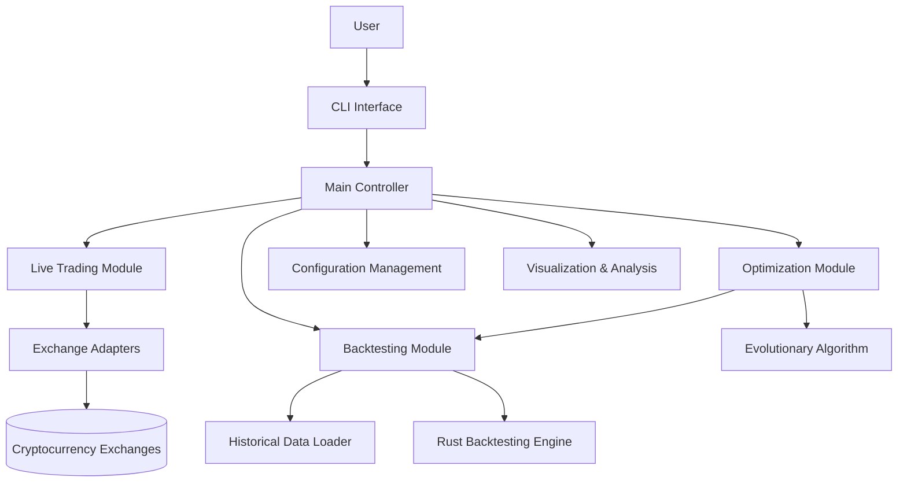
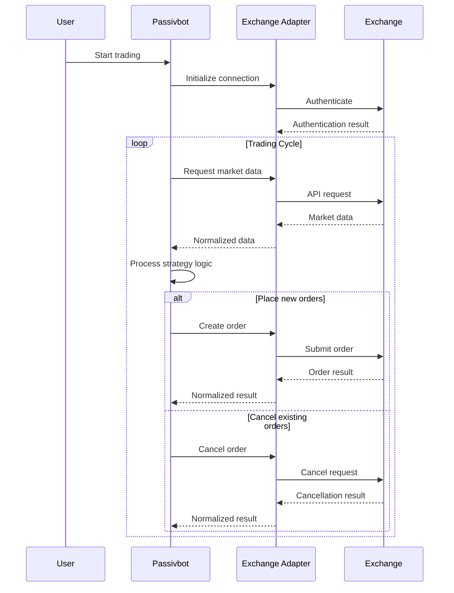
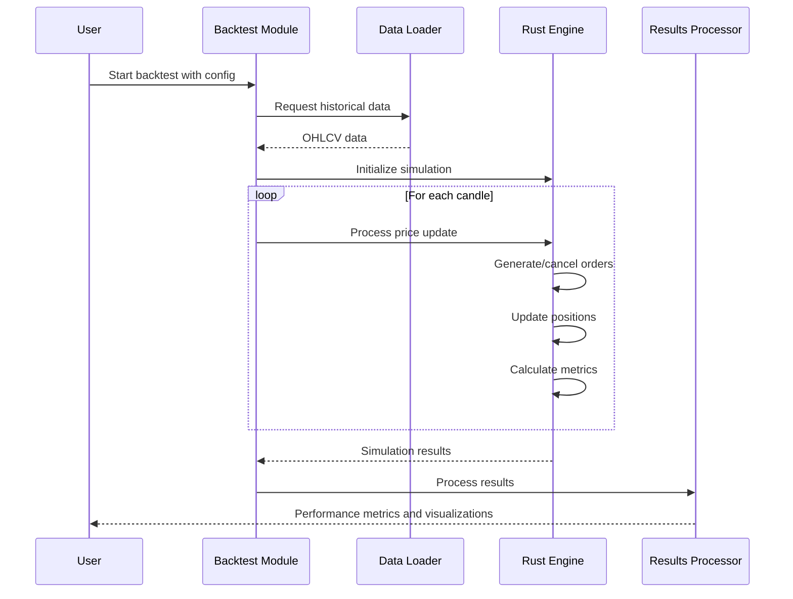

# System Patterns for Passivbot

## System Architecture

Passivbot follows a modular architecture that separates concerns across multiple components. The system is designed to be both flexible for users and performant for backtesting and optimization.



### Core Components

1. **CLI Interface** (main.py)
   - Parses command-line arguments
   - Initializes the appropriate module based on user commands
   - Handles user interaction during runtime

2. **Main Controller** (passivbot.py)
   - Central coordination point
   - Manages trading state and lifecycle
   - Dispatches to appropriate functional modules

3. **Live Trading Module**
   - Implements the core trading strategy
   - Manages real-time order placement and tracking
   - Handles position management and risk control

4. **Exchange Adapters** (exchanges/*.py)
   - Provide uniform interface to different exchanges
   - Handle exchange-specific API quirks
   - Implement authentication, rate limiting, and error handling

5. **Backtesting Module** (backtest.py)
   - Simulates trading on historical data
   - Calculates performance metrics
   - Provides feedback on strategy effectiveness

6. **Optimization Module** (optimize.py)
   - Implements evolutionary algorithms for parameter optimization
   - Manages population of candidate configurations
   - Converges toward optimal solutions

7. **Rust Performance Layer** (passivbot-rust/)
   - Accelerates CPU-intensive calculations
   - Implements core algorithms in Rust for speed
   - Exposes functionality to Python through bindings

## Key Technical Decisions

### 1. Hybrid Python/Rust Implementation

**Decision**: Implement core logic in Python for flexibility, with performance-critical components in Rust.

**Rationale**:
- Python provides excellent ecosystem for rapid development and extensibility
- Rust delivers near-native performance for compute-intensive operations
- Hybrid approach balances development speed with runtime performance

**Implementation**:
- Python handles high-level coordination, API interactions, and user interface
- Rust handles backtesting calculations, order generation logic, and performance-critical operations
- Maturin used for building Python bindings to Rust components

### 2. Exchange-Agnostic Core Design

**Decision**: Abstract exchange-specific logic into adapters while maintaining a unified core.

**Rationale**:
- Enables support for multiple exchanges without duplicating core logic
- Isolates exchange-specific quirks to contained modules
- Allows users to deploy the same strategy across different platforms

**Implementation**:
- Exchange-specific classes implement a common interface
- Core logic interacts with exchanges through this abstraction layer
- Configuration system handles exchange-specific parameters separately from strategy parameters

### 3. Configuration-Driven Behavior

**Decision**: Make all strategy parameters configurable through JSON files.

**Rationale**:
- Allows non-programmers to adjust strategy behavior
- Enables version control of configurations
- Facilitates optimization and backtesting of different parameter sets

**Implementation**:
- JSON schema for configuration
- Parameter validation and normalization
- Default templates and examples provided

### 4. Evolutionary Optimization

**Decision**: Use evolutionary algorithms for parameter optimization.

**Rationale**:
- Trading parameter space is too large for grid search
- Evolutionary approach efficiently finds near-optimal solutions
- Allows optimization for multiple competing objectives (returns vs. drawdown)

**Implementation**:
- Population-based optimization
- Fitness functions based on key performance metrics
- Multi-objective optimization for Pareto-optimal solutions

## Design Patterns

### 1. Adapter Pattern

Used to provide a consistent interface to different exchange APIs. Each exchange adapter translates the common interface into exchange-specific API calls.

**Examples**:
- Exchange adapter classes in exchanges/
- Each adapter implements methods like create_order(), cancel_order(), get_position(), etc.

### 2. Strategy Pattern

Different trading strategies (grid, recursive grid, neat grid) encapsulate specific trading algorithms but conform to a common interface.

**Examples**:
- Grid strategy logic in njit_funcs.py
- Recursive grid strategy in njit_funcs_recursive_grid.py
- Neat grid strategy in njit_funcs_neat_grid.py

### 3. Factory Pattern

Configuration-based instantiation of appropriate exchange adapters and strategy components.

**Examples**:
- Dynamic creation of exchange connectors based on configuration
- Initialization of appropriate strategy components based on user parameters

### 4. Observer Pattern

Event-driven architecture for handling market updates and order status changes.

**Examples**:
- Price update events triggering order placement logic
- Order status updates triggering position management logic

### 5. Command Pattern

Encapsulation of trading operations as discrete commands with standardized interfaces.

**Examples**:
- Order creation and cancellation operations
- Position management operations

## Component Relationships

### Exchange Interaction Flow



### Backtesting Process Flow



### Optimization Process Flow

```mermaid
flowchart TD
    Start[Start Optimization] --> InitPop[Initialize Population]
    InitPop --> EvalFitness[Evaluate Fitness]
    EvalFitness --> SelectParents[Select Parents]
    SelectParents --> Crossover[Crossover]
    Crossover --> Mutation[Mutation]
    Mutation --> NewPop[New Population]
    NewPop --> EvalNew[Evaluate New Individuals]
    EvalNew --> Replace[Replace Population]
    Replace --> Converged{Converged?}
    Converged -->|No| SelectParents
    Converged -->|Yes| Results[Return Results]
    
    subgraph Evaluation
        RunBT[Run Backtest] --> CalcMetrics[Calculate Metrics]
        CalcMetrics --> AssignFitness[Assign Fitness]
    end
    
    EvalFitness --> Evaluation
    EvalNew --> Evaluation
