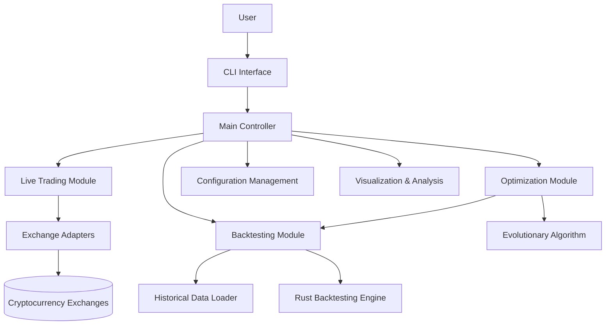
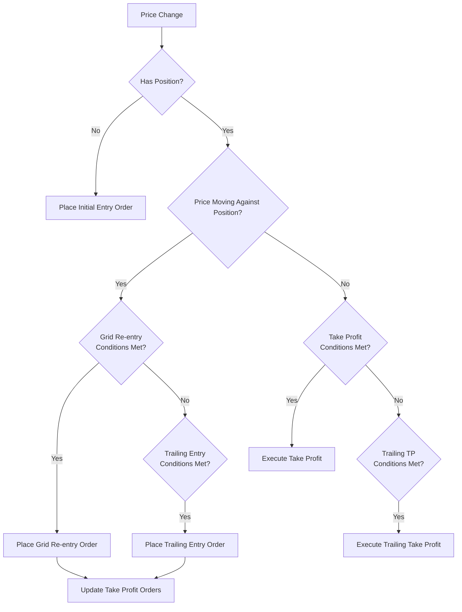
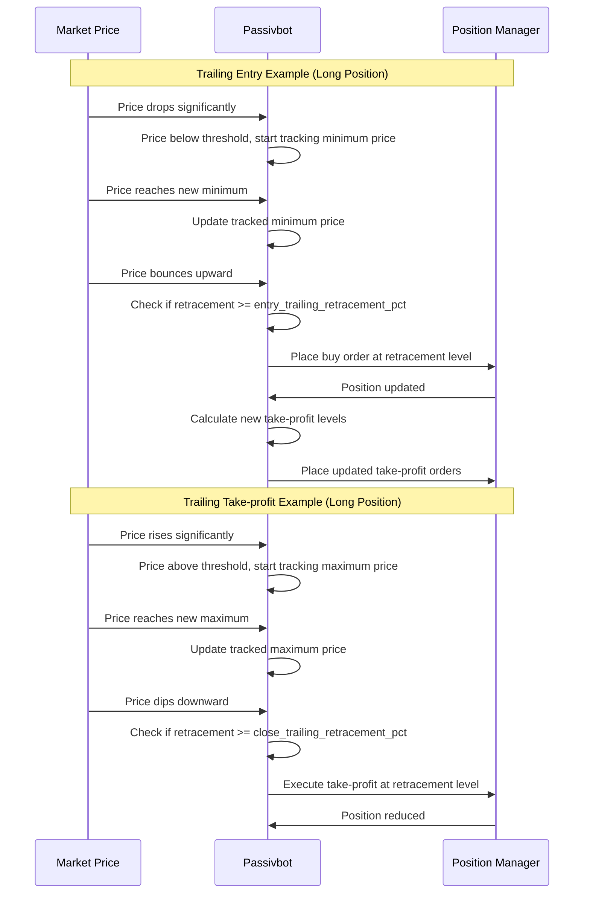
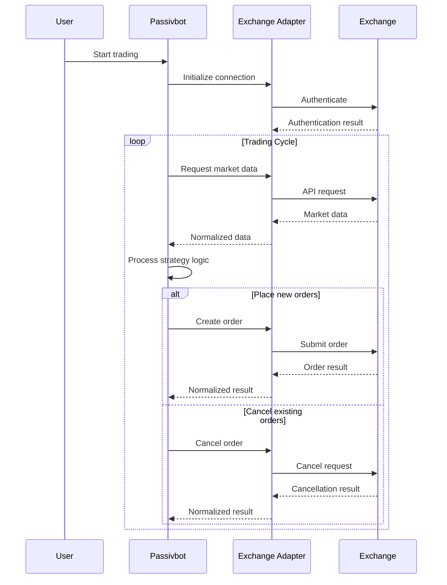
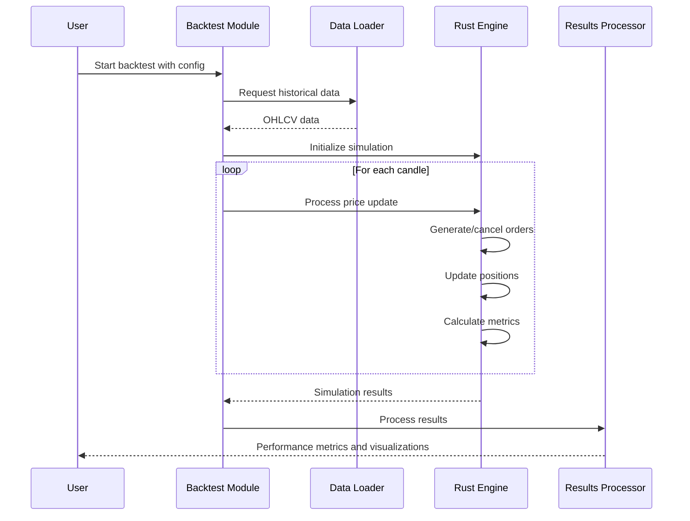
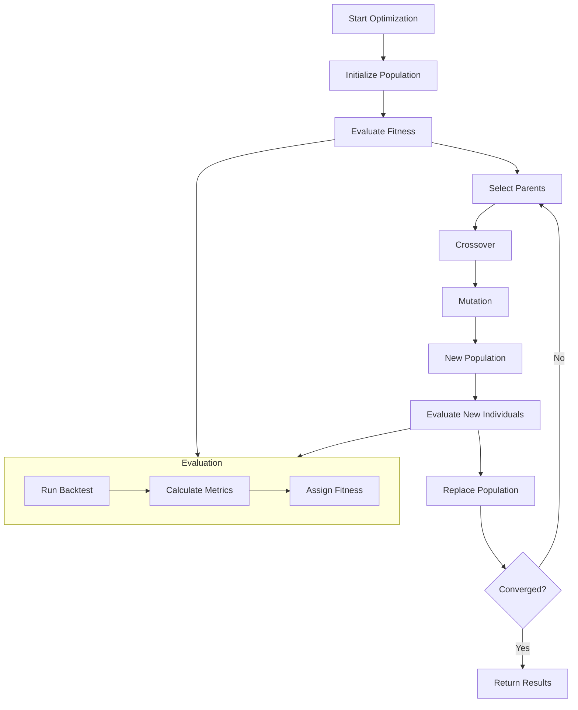

# System Patterns for Passivbot

## System Architecture

Passivbot follows a modular architecture that separates concerns across multiple components. The system is designed to be both flexible for users and performant for backtesting and optimization.



### Core Components

1. **CLI Interface** (main.py)
   - Parses command-line arguments
   - Initializes the appropriate module based on user commands
   - Handles user interaction during runtime

2. **Main Controller** (passivbot.py)
   - Central coordination point
   - Manages trading state and lifecycle
   - Dispatches to appropriate functional modules

3. **Live Trading Module**
   - Implements the core trading strategy
   - Manages real-time order placement and tracking
   - Handles position management and risk control

4. **Exchange Adapters** (exchanges/*.py)
   - Provide uniform interface to different exchanges
   - Handle exchange-specific API quirks
   - Implement authentication, rate limiting, and error handling

5. **Backtesting Module** (backtest.py)
   - Simulates trading on historical data
   - Calculates performance metrics
   - Provides feedback on strategy effectiveness

6. **Optimization Module** (optimize.py)
   - Implements evolutionary algorithms for parameter optimization
   - Manages population of candidate configurations
   - Converges toward optimal solutions

7. **Rust Performance Layer** (passivbot-rust/)
   - Accelerates CPU-intensive calculations
   - Implements core algorithms in Rust for speed
   - Exposes functionality to Python through bindings

## Trading Strategy Implementation

### Grid-based Market Making

Passivbot's core strategy is grid-based market making with Martingale-inspired re-entries. The strategy works as follows:

1. **Initial Entry**
   - Place an initial entry order at a price determined by the EMA band plus an offset (entry_initial_ema_dist)
   - The order size is calculated as: `balance * wallet_exposure_limit * entry_initial_qty_pct`
   - For long positions, entry is placed below the lower EMA band
   - For short positions, entry is placed above the upper EMA band

2. **Grid Re-entries**
   - If price moves against the position, additional entries are placed at specified intervals
   - Each grid level is spaced according to entry_grid_spacing_pct, modified by entry_grid_spacing_weight
   - Grid spacing increases as the position grows: `spacing = entry_grid_spacing_pct * (1 + ratio * entry_grid_spacing_weight)`
   - Each re-entry's size is determined by the previous position size multiplied by entry_grid_double_down_factor
   - This gradually increases order sizes to bring the average entry price closer to current price

3. **Take-profit Grid**
   - Multiple take-profit orders are placed above the average entry price (for longs) or below it (for shorts)
   - The closest TP order is placed at position_price * (1 + close_grid_min_markup) for longs
   - TP orders are distributed up to position_price * (1 + close_grid_min_markup + close_grid_markup_range)
   - Each TP order closes close_grid_qty_pct of the full position size
   - After each new entry, all TP orders are updated with the new average entry price



### Trailing Orders System

In addition to grid orders, Passivbot implements a trailing order system that waits for specific price movements before placing orders:

1. **Trailing Entries**
   - The bot tracks price movement away from the current position price
   - When price moves beyond the entry_trailing_threshold_pct, tracking begins
   - When price retraces by entry_trailing_retracement_pct from the extreme value, an entry order is placed
   - This allows entering on retracements after significant moves

2. **Trailing Take-profits**
   - Similar to trailing entries, but tracks favorable price movements
   - When price moves favorably by close_trailing_threshold_pct, tracking begins
   - When price retraces by close_trailing_retracement_pct, a take-profit order is executed
   - This attempts to capture profits near local extremes rather than at fixed levels

3. **Grid-Trailing Balance**
   - The *_trailing_grid_ratio parameters control the balance between grid and trailing orders
   - Positive values prioritize trailing orders first, then grid orders
   - Negative values prioritize grid orders first, then trailing orders
   - Values of 0.0 use only grid orders; values of 1.0 or -1.0 use only trailing orders



### Unstucking Mechanism

Passivbot manages underwater positions through a systematic unstucking process:

1. **Stuck Position Detection**
   - A position is considered "stuck" when its wallet_exposure ÷ wallet_exposure_limit > unstuck_threshold
   - For example, if threshold = 0.5, a position using more than 50% of its allowed exposure is considered stuck

2. **Prioritization**
   - If multiple positions are stuck, they are sorted by price distance to current market price
   - Positions closest to profitability are prioritized for unstucking
   - This focuses capital on salvaging positions with the best chances of recovery

3. **Loss Allowance Calculation**
   - The unstuck_loss_allowance_pct sets the maximum percentage of past peak balance allowed for losses
   - The algorithm tracks the historical peak balance and limits realized losses accordingly
   - This creates a balance-based circuit breaker to prevent excessive drawdowns

4. **Gradual Close Process**
   - Rather than closing entire underwater positions at once, the bot closes small portions (unstuck_close_pct)
   - For long positions, close orders are placed at upper_EMA_band * (1 + unstuck_ema_dist)
   - For short positions, close orders are placed at lower_EMA_band * (1 - unstuck_ema_dist)
   - This approach minimizes market impact and allows gradual recovery

### Forager Feature for Coin Selection

The Forager feature dynamically selects which markets to trade based on volatility metrics:

1. **Volatility Calculation**
   - For each coin, volatility is calculated as mean((high - low) / close) over recent candles
   - This uses filter_noisiness_rolling_window parameter to determine the lookback period
   - Higher values indicate more volatile (and potentially profitable) markets

2. **Volume Filtering**
   - Before ranking by volatility, coins are filtered by volume
   - The filter_volume_drop_pct parameter drops the lowest-volume coins
   - For example, if set to 0.1, the bottom 10% by volume are excluded
   - This ensures sufficient liquidity for effective trading

3. **Dynamic Selection Process**
   - Forager mode is automatically enabled when n_positions is less than the number of approved coins
   - The most volatile coins (after volume filtering) are selected for trading
   - Selection is dynamic and continuously updated as market conditions change
   - This concentrates capital in markets with the most trading opportunities

4. **Coin Approval Controls**
   - The approved_coins parameter in the live config defines eligible coins
   - The ignored_coins parameter excludes specific coins from trading
   - If approved_coins is empty and empty_means_all_approved is true, all available coins are considered
   - Coins younger than minimum_coin_age_days are automatically filtered out

## Key Technical Decisions

### 1. Hybrid Python/Rust Implementation

**Decision**: Implement core logic in Python for flexibility, with performance-critical components in Rust.

**Rationale**:
- Python provides excellent ecosystem for rapid development and extensibility
- Rust delivers near-native performance for compute-intensive operations
- Hybrid approach balances development speed with runtime performance

**Implementation**:
- Python handles high-level coordination, API interactions, and user interface
- Rust handles backtesting calculations, order generation logic, and performance-critical operations
- Maturin used for building Python bindings to Rust components

### 2. Exchange-Agnostic Core Design

**Decision**: Abstract exchange-specific logic into adapters while maintaining a unified core.

**Rationale**:
- Enables support for multiple exchanges without duplicating core logic
- Isolates exchange-specific quirks to contained modules
- Allows users to deploy the same strategy across different platforms

**Implementation**:
- Exchange-specific classes implement a common interface
- Core logic interacts with exchanges through this abstraction layer
- Configuration system handles exchange-specific parameters separately from strategy parameters

### 3. Configuration-Driven Behavior

**Decision**: Make all strategy parameters configurable through JSON files.

**Rationale**:
- Allows non-programmers to adjust strategy behavior
- Enables version control of configurations
- Facilitates optimization and backtesting of different parameter sets

**Implementation**:
- JSON schema for configuration
- Parameter validation and normalization
- Default templates and examples provided

### 4. Evolutionary Optimization

**Decision**: Use evolutionary algorithms for parameter optimization.

**Rationale**:
- Trading parameter space is too large for grid search
- Evolutionary approach efficiently finds near-optimal solutions
- Allows optimization for multiple competing objectives (returns vs. drawdown)

**Implementation**:
- Population-based optimization
- Fitness functions based on key performance metrics
- Multi-objective optimization for Pareto-optimal solutions

## Design Patterns

### 1. Adapter Pattern

Used to provide a consistent interface to different exchange APIs. Each exchange adapter translates the common interface into exchange-specific API calls.

**Examples**:
- Exchange adapter classes in exchanges/
- Each adapter implements methods like create_order(), cancel_order(), get_position(), etc.

### 2. Strategy Pattern

Different trading strategies (grid, recursive grid, neat grid) encapsulate specific trading algorithms but conform to a common interface.

**Examples**:
- Grid strategy logic in njit_funcs.py
- Recursive grid strategy in njit_funcs_recursive_grid.py
- Neat grid strategy in njit_funcs_neat_grid.py

### 3. Factory Pattern

Configuration-based instantiation of appropriate exchange adapters and strategy components.

**Examples**:
- Dynamic creation of exchange connectors based on configuration
- Initialization of appropriate strategy components based on user parameters

### 4. Observer Pattern

Event-driven architecture for handling market updates and order status changes.

**Examples**:
- Price update events triggering order placement logic
- Order status updates triggering position management logic

### 5. Command Pattern

Encapsulation of trading operations as discrete commands with standardized interfaces.

**Examples**:
- Order creation and cancellation operations
- Position management operations

## Component Relationships

### Exchange Interaction Flow



### Backtesting Process Flow



### Optimization Process Flow



### Risk Management Architecture

```mermaid
flowchart LR
    Config[Config Parameters] --> RiskControls[Risk Control System]
    
    subgraph RiskControls
        WalletExposure[Wallet Exposure Limits]
        PositionSizing[Position Sizing Logic]
        Unstucking[Unstucking Mechanism]
        Diversification[Multi-coin Diversification]
    end
    
    Market[Market Data] --> RiskControls
    Balance[Account Balance] --> RiskControls
    PeakBalance[Historical Peak Balance] --> Unstucking
    
    RiskControls --> OrderLimits[Order Size/Quantity Limits]
    RiskControls --> StopLogic[Position Reduction Logic]
    
    OrderLimits --> Orders[Order Generation]
    StopLogic --> Orders
